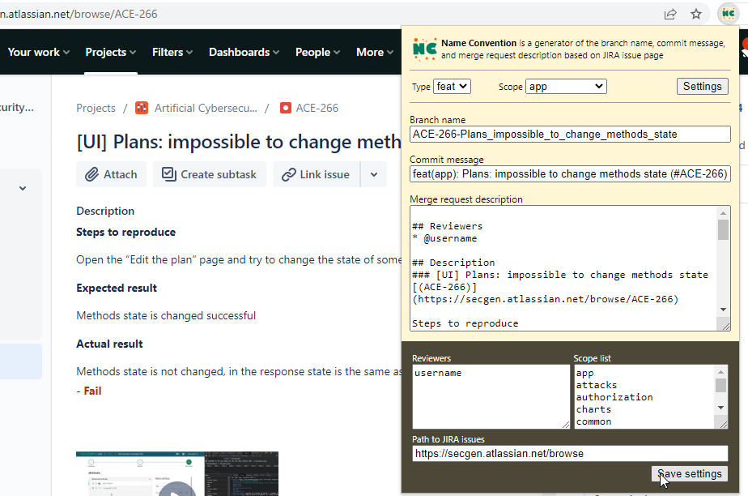

# Name Convention

**Naming convention** is a generator of the branch name, commit message, and merge request description based on JIRA issue
page.

Only for **JIRA** tasks!

## How to install

1. Clone the repos: `git clone git`
2. Go to Chrome menu -> More tools -> Extensions
3. Turn On the __Developer mode__
4. Click __Load unpacked__ and select a folder `C:\projects\name-convention\name-convention`
5. Enjoy!

## How to use

**On a JIRA task page click to the extension icon**

You will get the following things:

* A branch name
* A commit message
* A merge request description.

You can change a type (bug/feat) of task and select a scope.

### Settings
You can change reviewers and scope list in the settings

